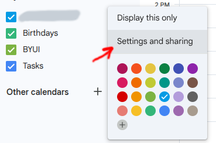
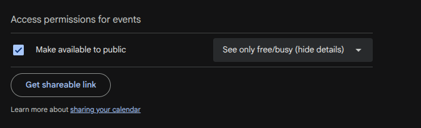
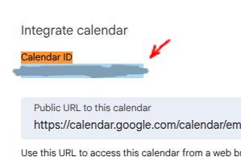

# Event sorter
Find events in your area and sort them by date, location, and availability.
This program assumes the user is in the United States

# Setup
You must modify the config.json file in the root directory of the project, applying your API keys.

# Required Steps
### 1. Setup API key with serp api
https://serpapi.com/dashboard

Add the API key to the config.json file

### 2. Setup an API key with google calendar integration
https://console.cloud.google.com
https://developers.google.com/workspace/calendar/api/quickstart/go

Add the API key to the config.json file

### 3. Connect your google calendar
You also need to connect a real google calendar to the program
1. Open [google calendar](https://calendar.google.com/)
2. Click calendar options (3 dots) and select "Settings & Sharing"
- 
- 
   4. Make SURE "see only free/busy (hide detail)" is selected
   5. Setting this option prevents strangers from seeing your events details, location, and description
5. The Calendar ID will be available on the same page, that is the calendarId you need to use in the config
- 
  - **You may add the calendar ID to the config.json or just use the program itself to enter it.**

----------------------------------

### A few notes about Privacy settings
If all your events are showing up as "Untitled Event" even though they have clear titles on your personal screen, it means the Google Calendar API is intentionally redacting the text before it reaches your code.

Because you are using a standard API Key on a public calendar link, Google applies a strict privacy filter to the payload based on your sharing settings:

When you made the calendar public, the permission dropdown in your Google Calendar settings was likely left on the default: "See only free/busy (hide details)".

When this happens:
* Google considers the existence of the event public (so your code successfully finds a block of time).
* Google considers the details (like the Title, Description, and Location) strictly private.
* To protect your privacy, the API scrubs the Summary field completely, which causes your C# code to fall back to "Untitled Event".